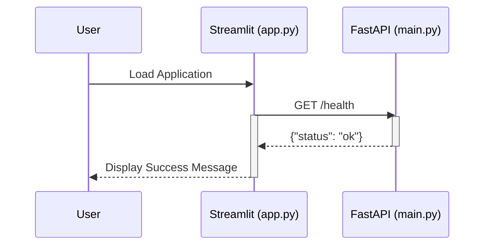
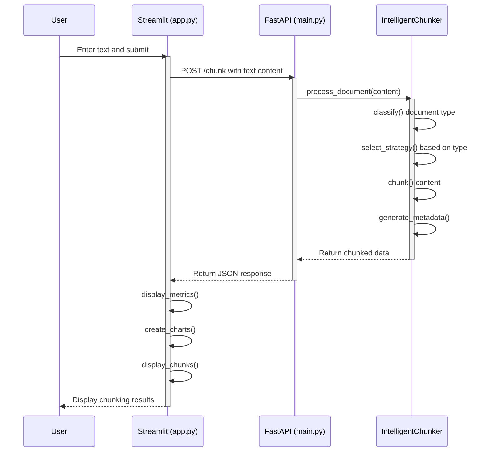
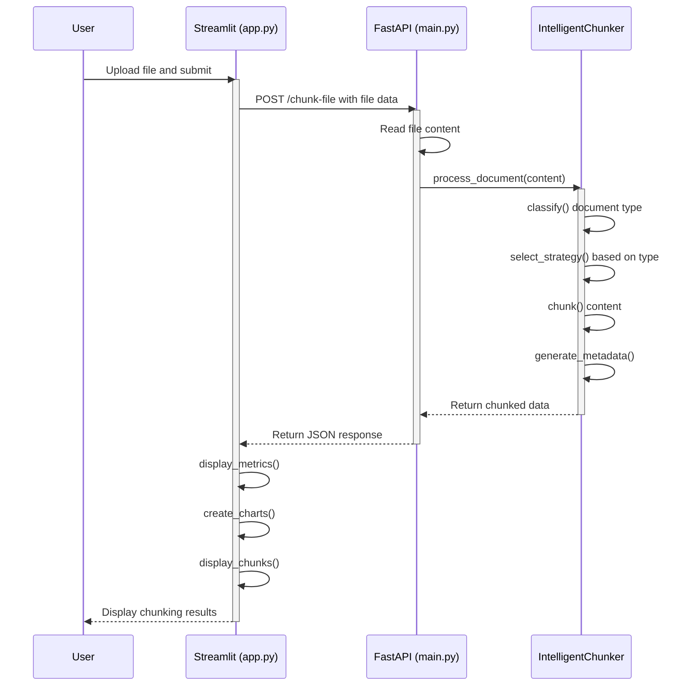
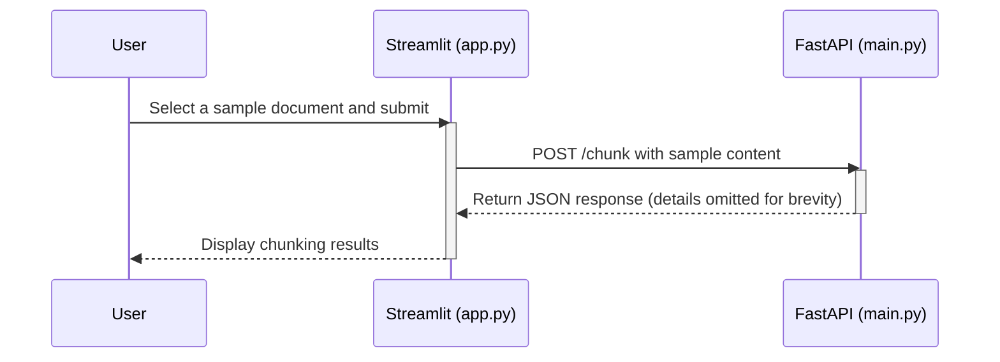

# Application Flow for Intelligent Document Chunking System

This document outlines the flow of data and function calls within the Intelligent Document Chunking System. The system consists of a Streamlit frontend (`app.py`) and a FastAPI backend (`main.py`).

## 1. Health Check on Application Load

When the Streamlit application is first loaded, it checks the health of the FastAPI backend.

**Arrow Flow:**
`User -> Streamlit UI (app.py) -> main() -> check_api_health() -> requests.get("/health") -> FastAPI Backend (main.py) -> /health endpoint -> Returns {"status": "ok"}`

**Mermaid Diagram:**

## 2. Processing Text Input

When a user enters text and clicks "Process Document", the following sequence occurs.

**Arrow Flow:**
`User -> Enters text -> Clicks "Process Document" -> main() [input_method == "Text Input"] -> chunk_document(content, filename, doc_id) -> requests.post("/chunk") -> FastAPI Backend -> /chunk endpoint -> IntelligentChunker.process_document() -> DocumentClassifier.classify() -> Selects chunker -> chunker.chunk() -> generate_metadata() -> Returns JSON -> display_metrics(), create_..._chart(), display_chunks() -> User sees results`

**Mermaid Diagram:**

## 3. Processing a File Upload

When a user uploads a file and clicks "Process File", the flow is similar to text processing, but it uses a different endpoint for file handling.

**Arrow Flow:**
`User -> Uploads file -> Clicks "Process File" -> main() [input_method == "File Upload"] -> chunk_file(file_content, filename) -> requests.post("/chunk-file") -> FastAPI Backend -> /chunk-file endpoint -> Reads file -> IntelligentChunker.process_document() -> ... (same as text processing) ... -> User sees results`

**Mermaid Diagram:**

## 4. Using Sample Documents

When a user selects a sample document, the frontend sends the pre-defined content to the backend for processing.

**Arrow Flow:**
`User -> Selects sample document -> Clicks "Process Sample" -> main() [input_method == "Sample Documents"] -> chunk_document(sample_content, sample_filename) -> requests.post("/chunk") -> ... (same as text processing) ... -> User sees results`

**Mermaid Diagram:**

